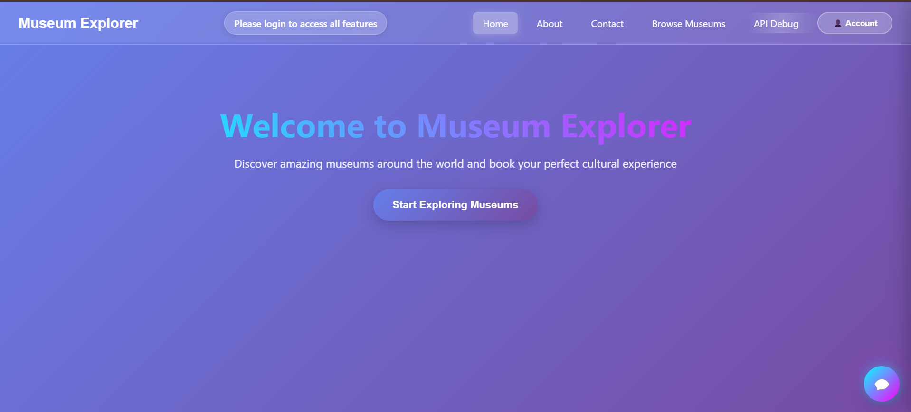
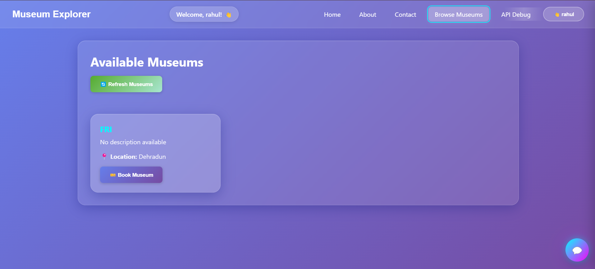
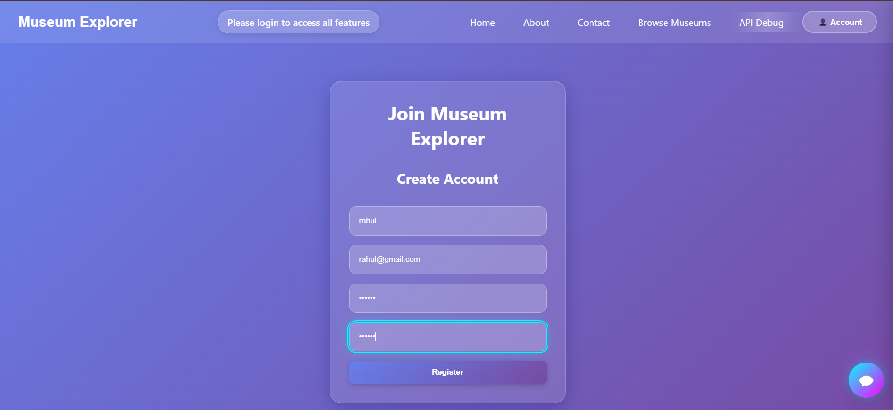
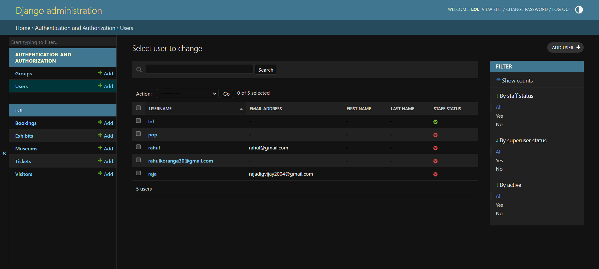
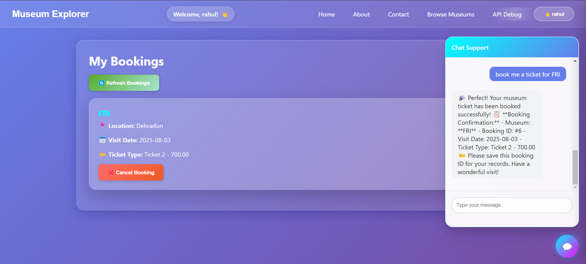

# Museum Explorer 🏛️

A modern, full-stack museum booking and exploration platform that combines a beautiful React frontend with a powerful Django backend and intelligent AI chatbot assistant.

## 🌟 Overview

Museum Explorer is your gateway to discovering and experiencing the world's most fascinating museums. Our platform connects culture enthusiasts with premier museums, offering seamless booking experiences, curated content, and AI-powered assistance to enhance your cultural journey.

---

## 📸 Screenshots

### Homepage

*Beautiful glassmorphism design with gradient background and intuitive navigation*

### Museum Browsing

*Explore museums with detailed information and one-click booking*

### Authentication Interface

*Seamless login and registration with modern form design*

### Admin Dashboard

*Side canvas showing personalized options and booking management*

### AI Chatbot Interface

*Intelligent AI assistant with neon glow effects and conversational booking*

---

## 🚀 Features

### 🎨 **Modern User Interface**
- **Glassmorphism Design**: Beautiful translucent interfaces with backdrop blur effects
- **Gradient Backgrounds**: Stunning visual aesthetics with purple-blue gradients
- **Neon Effects**: Selective neon glows on interactive elements (chat button, navbar hover)
- **Responsive Design**: Seamless experience across desktop, tablet, and mobile devices
- **Classic Styling**: Elegant, professional appearance for forms and content areas

### 🔐 **Complete Authentication System**
- **User Registration**: Secure account creation with email validation
- **JWT Authentication**: Token-based authentication for secure API communication
- **Login/Logout**: Seamless authentication flow with persistent sessions
- **Profile Management**: User profile access through elegant side canvas interface
- **Real-time Status**: Navigation bar displays current login status and welcome messages

### 🏛️ **Museum Management**
- **Public Museum Browsing**: Explore museums without requiring login
- **Detailed Museum Information**: View descriptions, locations, and details
- **Smart Booking System**: Reserve tickets for museums with single-click booking
- **Booking Management**: View, track, and cancel existing reservations
- **Real-time Updates**: Live synchronization with backend database

### 🤖 **Intelligent AI Chatbot Assistant**
- **Natural Language Processing**: Powered by Google's Gemini 2.0 Flash model for intelligent conversations
- **Museum Information**: Provides details about exhibits, opening hours, locations, and general museum information
- **Smart Ticket Booking**: Book museum tickets through simple conversational commands
  - "I want to book a ticket"
  - "Reserve tickets for Science Museum"
  - "Book a visit for Friday"
- **Intelligent Museum Matching**: Uses fuzzy string matching to identify museums even with partial or inexact names
- **Authentication Integration**: Securely integrates with Django authentication system
- **Real-time Assistance**: 24/7 availability for visitor inquiries and support

### 🎯 **Navigation & User Experience**
- **Intuitive Navigation**: Clean navbar with Home, About, Contact sections
- **Smart Routing**: Dynamic content loading without page refreshes
- **User Dashboard**: Side canvas showing personalized options based on login status
- **Progressive Disclosure**: Features unlock as users authenticate
- **Contextual Messaging**: Smart prompts and guidance throughout the experience

---

## 🛠️ Technology Stack

### Frontend (React)
- **React 18.2.0**: Modern functional components with hooks
- **Axios**: HTTP client for API communication
- **CSS3**: Custom styling with glassmorphism and responsive design
- **Environment Configuration**: Dynamic API endpoint management

### Backend (Django)
- **Django REST Framework**: Robust API development
- **JWT Authentication**: Simple JWT for token-based auth
- **CORS Headers**: Cross-origin resource sharing support
- **SQLite Database**: Lightweight database for development
- **Custom API Views**: Specialized endpoints for museum and booking management

### AI Chatbot (FastAPI)
- **FastAPI Framework**: High-performance asynchronous web framework
- **Google Gemini 2.0 Flash**: Advanced AI model for natural language processing
- **Fuzzy String Matching**: Intelligent text processing for user inputs
- **JWT Integration**: Secure authentication with Django backend
- **Real-time Processing**: Instant response generation and booking handling

### Infrastructure
- **Ngrok Tunneling**: Secure local development exposure
- **Environment Variables**: Centralized configuration management
- **CORS Configuration**: Seamless frontend-backend communication
- **Error Handling**: Comprehensive exception management across all layers

---

## 📋 API Endpoints

### Authentication
- `POST /lol/api/token/` - Obtain JWT tokens
- `POST /lol/api/token/refresh/` - Refresh access tokens
- `POST /lol/api/register/` - User registration
- `POST /lol/api/login/` - User login

### Museums & Bookings
- `GET /lol/api/browse/` - Browse available museums (public)
- `POST /lol/api/book_museum/<int:museum_id>/` - Book museum tickets (authenticated)
- `GET /lol/api/my_bookings/` - View user bookings (authenticated)
- `POST /lol/api/cancel_booking/<int:booking_id>/` - Cancel booking (authenticated)

### AI Chatbot
- `POST /chat` - Chat with AI assistant (authenticated)

---

## 🎯 User Experience Flows

### For New Visitors:
1. **Explore Homepage**: Learn about Museum Explorer and its features
2. **Browse Museums**: View available museums and their details (no login required)
3. **Create Account**: Register for personalized booking capabilities
4. **Book Museums**: Reserve tickets for preferred museums
5. **Manage Bookings**: View and cancel reservations through user dashboard

### For Authenticated Users:
1. **Personalized Dashboard**: Access booking history and account management
2. **One-Click Booking**: Reserve museum tickets instantly
3. **AI Chat Support**: Get instant assistance for inquiries and bookings
4. **Booking Management**: Track, modify, and cancel reservations

### Chatbot Interaction Flow:
1. **General Inquiries**: Ask about museum information, hours, exhibits
2. **Booking Requests**: Express booking intent through natural language
3. **Authentication Check**: System verifies login status for booking operations
4. **Automatic Processing**: AI handles booking workflow and provides confirmation
5. **Error Handling**: Graceful handling of conflicts and system issues

---

## 🔧 Installation & Setup

### Prerequisites
- Node.js (v14 or higher)
- Python 3.8+
- Django 4.x
- Git

### Backend Setup (Django)
```bash
# Clone the repository
git clone [repository-url]
cd django

# Create virtual environment
python -m venv venv
venv\Scripts\activate  # Windows
# source venv/bin/activate  # Linux/Mac

# Install dependencies
pip install django djangorestframework djangorestframework-simplejwt django-cors-headers

# Run migrations
python manage.py makemigrations
python manage.py migrate

# Create superuser (optional)
python manage.py createsuperuser

# Start Django development server
python manage.py runserver
```

### Frontend Setup (React)
```bash
# Navigate to frontend directory
cd frontend

# Install dependencies
npm install

# Create environment file
echo "REACT_APP_BACKEND_URL=http://localhost:8000" > .env

# Start React development server
npm start
```

### Chatbot Setup (FastAPI)
```bash
# Install FastAPI and dependencies
pip install fastapi uvicorn google-generativeai python-jose python-multipart

# Set up Google Gemini API key
# Add your API key to the chatbot configuration

# Start FastAPI server
uvicorn main:app --reload --port 8001
```

### Environment Configuration
Update `.env` file in the frontend directory:
```env
# Backend API Configuration
REACT_APP_BACKEND_URL=http://localhost:8000

# For production with ngrok:
# REACT_APP_BACKEND_URL=https://your-ngrok-url.ngrok-free.app
```

---

## 🌐 Deployment

### Development with Ngrok
1. **Expose Django Backend**:
   ```bash
   ngrok http 8000
   ```

2. **Update Environment Variables**:
   ```env
   REACT_APP_BACKEND_URL=https://your-ngrok-url.ngrok-free.app
   ```

3. **Configure CORS**: Add ngrok URL to Django CORS settings

### Production Deployment
- **Frontend**: Deploy to Vercel, Netlify, or similar platform
- **Backend**: Deploy to Heroku, Railway, or cloud hosting
- **Database**: Migrate to PostgreSQL for production
- **Chatbot**: Deploy FastAPI to cloud infrastructure

---

## 🤝 Contributing

We welcome contributions to Museum Explorer! Please follow these steps:

1. Fork the repository
2. Create a feature branch (`git checkout -b feature/amazing-feature`)
3. Commit your changes (`git commit -m 'Add amazing feature'`)
4. Push to the branch (`git push origin feature/amazing-feature`)
5. Open a Pull Request

---

## 📝 License

This project is licensed under the MIT License - see the [LICENSE](LICENSE) file for details.

---

## 🆘 Support

For support, email support@museumexplorer.com or join our community chat.

---

## 🙏 Acknowledgments

- **Google Gemini AI**: For providing the intelligent chatbot capabilities
- **Django Community**: For the robust backend framework
- **React Team**: For the excellent frontend library
- **Museum Partners**: For inspiration and collaboration

---

**Built with ❤️ for culture enthusiasts worldwide**

*Museum Explorer - Unlock the doors to knowledge and wonder* 🎨🏛️✨
